# OCR 실습 사전 준비: Google Vision·Gemini API 키 발급 안내

이 문서는 Google Cloud Vision API로 이미지에서 텍스트를 추출하고, Google Gemini API로 추출 결과를 문맥에 맞게 교정하는 OCR 공정을 실습하기 위한 공통 준비 안내다. 두 기능을 사용하려면 실습 전에 각각의 "키"를 발급받아야 한다.

키란 무엇인가. 챗GPT 같은 챗봇은 화면에서 대화하며 사용하지만, 본 실습에서는 프로그램이 Google의 인공지능 기능을 직접 호출한다. 이때 "누가 호출했는지"를 증명하는 출입증이 키다. 키가 없으면 프로그램이 작동하지 않는다.

이 문서는 여러 강의·워크숍에서 공통으로 쓰는 사전 준비 안내다. 실습 자료와 일정, 다루는 사료는 강의마다 다르므로 각 강의 안내를 따른다.

아래 절차는 처음 하는 경우 약 30분이 소요된다. **실습 전에 미리 완료**해 두어야 당일 실습을 바로 시작할 수 있다. 강의·워크숍 참가자는 중간에 막히면 막힌 화면을 캡처하여 해당 강의 안내문에 명시된 문의처로 보내주기 바란다.

**목차**

1. [준비물](#1-준비물)
2. [발급할 키는 두 개다](#2-발급할-키는-두-개다)
3. [첫 번째 키: Vision API 서비스 계정 JSON 파일 발급](#3-첫-번째-키-vision-api-서비스-계정-json-파일-발급)
4. [두 번째 키: Gemini API 문자열 키 발급](#4-두-번째-키-gemini-api-문자열-키-발급)
5. [Colab 접속 확인과 키 파일 올리기](#5-colab-접속-확인과-키-파일-올리기)
6. [예상 비용](#6-예상-비용)
7. [막혔을 때: 자주 발생하는 문제](#7-막혔을-때-자주-발생하는-문제)
8. [최종 체크리스트](#8-최종-체크리스트)

---

## 1. 준비물

| 항목 | 비고 |
|---|---|
| 개인 Google 계정 | **소속 기관 계정 불가.** 기관 계정은 관리자 정책상 API 키 발급과 결제 설정이 막혀 있는 경우가 많다. 개인 계정이 없으면 google.com에서 새로 만든다. Gmail 주소가 있다면 그것이 개인 Google 계정이다. |
| 해외 결제 가능한 신용카드 또는 체크카드 | Google Cloud 결제 계정 등록에 필요하다. 등록만으로 비용이 청구되지 않으며, 본인 확인을 위한 소액(약 1달러)이 승인 후 자동 취소될 수 있다. |
| PC와 Chrome 브라우저 | 스마트폰이나 태블릿으로는 일부 절차가 진행되지 않는다. 반드시 PC에서 진행한다. |

## 2. 발급할 키는 두 개다

이 공정은 서로 다른 두 개의 키를 사용한다. **발급받는 곳도, 생김새도 다르다.** 실습에서 가장 자주 발생하는 오류가 두 키를 서로 바꿔 넣는 것이므로, 시작 전에 아래 표를 한 번 읽어두기 바란다.

| 구분 | 첫 번째 키: Vision API | 두 번째 키: Gemini API |
|---|---|---|
| 하는 일 | 이미지에서 텍스트 추출 | 추출된 텍스트의 문맥 교정 |
| 발급받는 곳 | Google Cloud Console | Google AI Studio |
| 생김새 | **JSON 파일** — 컴퓨터에 다운로드되는 파일 하나 | **문자열** — 긴 글자 한 줄(예: `AQ...` 형태) |
| 보관 방법 | 바탕화면 ocr-workshop 폴더에 보관한 뒤 **Google Drive에 올린다**(5-2) | 메모장에 붙여넣어 같은 폴더에 저장 |

> 이하 안내의 화면은 2026년 7월에 실제 발급 과정을 캡처한 것이다. Google의 화면 개편에 따라 문구와 버튼 위치가 다소 달라질 수 있으나, 비슷한 이름의 메뉴를 찾으면 된다.

## 3. 첫 번째 키: Vision API 서비스 계정 JSON 파일 발급

전체 흐름은 다섯 단계다. ① 로그인 → ② 프로젝트 만들기 → ③ 결제 등록 → ④ Vision API 켜기 → ⑤ JSON 파일 내려받기.

### 3-1. Google Cloud Console에 로그인하기

1. Chrome을 실행한다.
2. 화면 위쪽 주소창을 클릭하고 `console.cloud.google.com` 을 입력한 뒤 Enter 키를 누른다.
3. 로그인 화면이 나오면 **개인 Google 계정**의 이메일 주소를 입력하고 [다음]을 누른다. 비밀번호를 입력하고 다시 [다음]을 누른다.
4. 이미 로그인되어 있는 경우: 화면 **오른쪽 맨 위의 동그란 프로필 아이콘**을 클릭한다. 현재 로그인된 계정의 이메일 주소가 표시된다.
   - 개인 계정(예: `xxx@gmail.com`)이면 그대로 진행한다.
   - 기관 계정(예: `xxx@대학.ac.kr`, `xxx@기관.re.kr`)이면 목록에서 개인 계정을 클릭해 전환한다. 목록에 개인 계정이 없으면 [다른 계정 추가]를 눌러 로그인한다.
5. 이 사이트에 처음 접속하면 "Google Cloud에 오신 것을 환영합니다"라는 화면과 함께 서비스 약관 동의 창이 나온다. 약관 체크박스를 선택하고 [동의 및 계속하기]를 누른다.

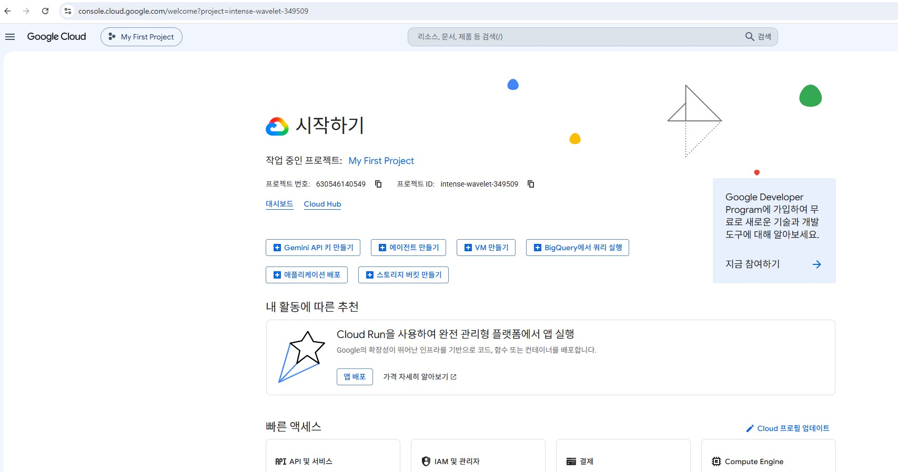

*[그림 1] 접속 직후 "시작하기" 화면. 처음에는 "My First Project"라는 기본 프로젝트가 표시된다*

> ✔ **여기까지 확인**: 화면 왼쪽 위에 "Google Cloud"라는 글자가 보이고, 오른쪽 위 프로필 아이콘에 개인 계정이 표시되어 있으면 된다.

### 3-2. 새 프로젝트 만들기

프로젝트란 이번 실습에서 쓰는 작업 공간의 이름이다. 이후의 모든 설정(결제, API, 키)이 이 프로젝트 안에 담긴다.

1. 화면 **왼쪽 위**, "Google Cloud" 로고 바로 오른쪽에 있는 버튼을 클릭한다. 이 버튼에는 "프로젝트 선택" 또는 "My First Project" 같은 글자가 적혀 있다.
2. "프로젝트 선택" 팝업 창이 열린다. 팝업 창의 **오른쪽 위**에 있는 [새 프로젝트]를 클릭한다.

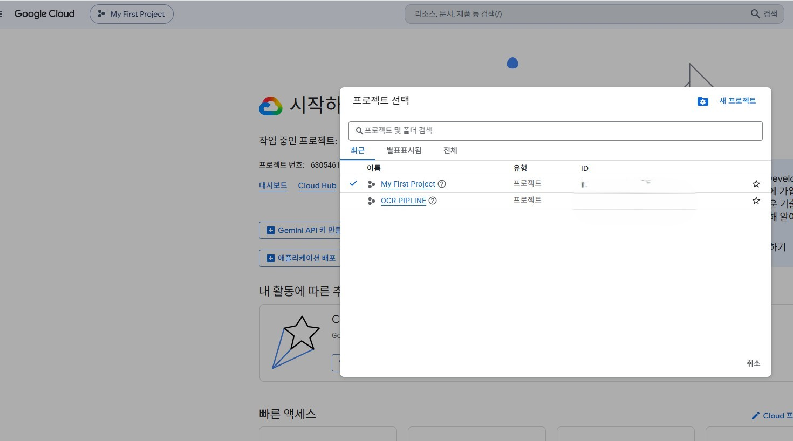

*[그림 2] 프로젝트 선택 팝업. 오른쪽 위의 [새 프로젝트]를 클릭한다*

3. "프로젝트 이름" 입력 칸에 `ocr-workshop` 을 입력한다. 한글은 사용할 수 없으며, 영문 소문자·숫자·하이픈(-)만 가능하다. 다른 이름을 써도 무방하나, 이후 안내에서는 ocr-workshop으로 부른다.
4. "위치" 항목은 "조직 없음" 그대로 둔다.
5. [만들기]를 클릭한다.

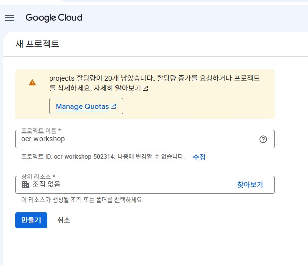

*[그림 3] 새 프로젝트 이름 입력 화면*

6. 10초 정도 기다리면 화면 오른쪽 위 종 모양 알림 아이콘에 "프로젝트 ocr-workshop 만들기" 완료 표시가 뜬다.

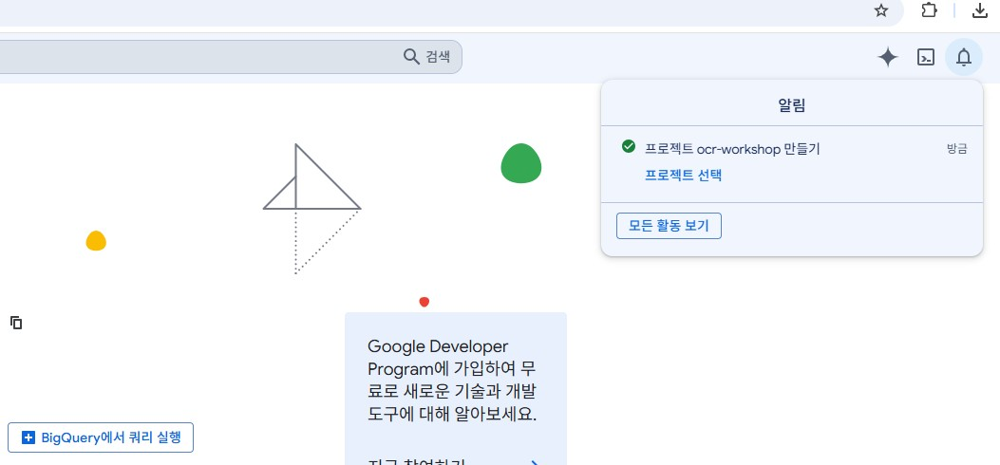

*[그림 4] 오른쪽 위 알림에 프로젝트 생성 완료가 표시된다. 여기서 [프로젝트 선택]을 눌러도 된다*

7. 다시 왼쪽 위의 프로젝트 선택 버튼을 클릭하고, 목록에서 방금 만든 **ocr-workshop**을 클릭한다.

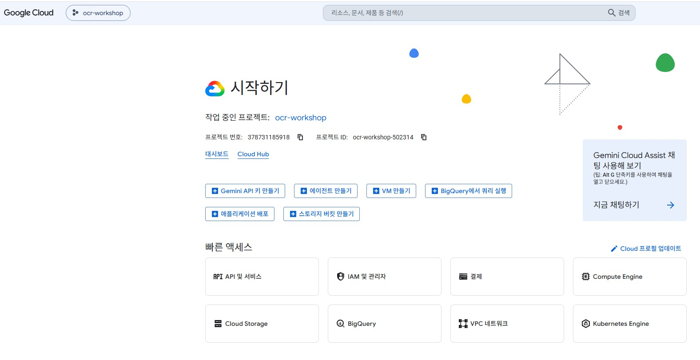

*[그림 5] 프로젝트 전환 완료. "작업 중인 프로젝트: ocr-workshop"으로 표시된다*

> ✔ **여기까지 확인**: 화면 왼쪽 위 버튼에 `ocr-workshop`이라는 글자가 표시되어 있으면 된다. 이후 모든 작업은 이 상태에서 진행한다.

### 3-3. 결제 계정 등록하기

API는 사용량만큼 요금이 계산되는 방식이라, 사용 전 결제 수단 등록이 필수다. **등록 자체로는 비용이 발생하지 않는다.** 실제 예상 비용은 [6. 예상 비용](#6-예상-비용)에 정리했다.

1. 화면 **왼쪽 맨 위**에 있는 가로줄 세 개(☰) 아이콘을 클릭한다. 이것을 "탐색 메뉴"라고 부른다.

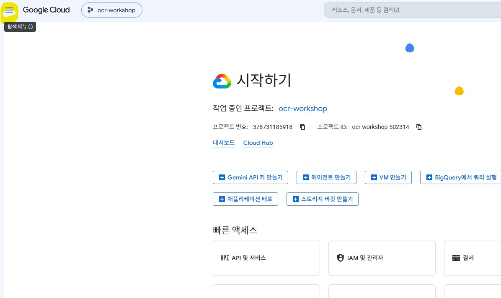

*[그림 6] 왼쪽 맨 위의 탐색 메뉴(☰) 위치*

2. 펼쳐진 목록에서 [결제]를 클릭한다.

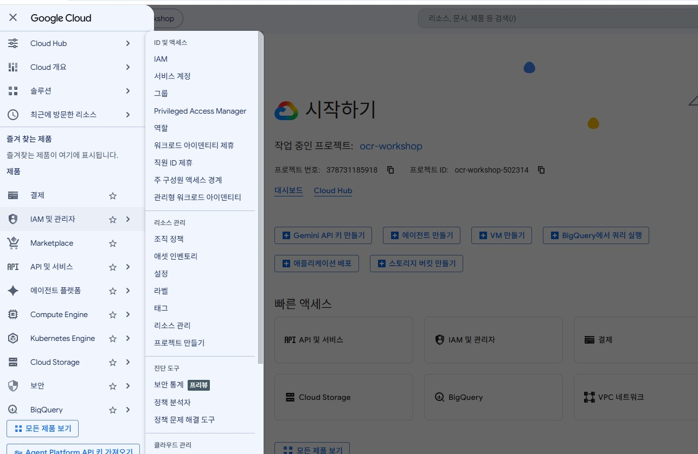

*[그림 7] 탐색 메뉴를 펼친 화면. 왼쪽 목록에 [결제]가 있다. 3-5에서 사용할 [IAM 및 관리자] → [서비스 계정]도 같은 메뉴에 있다*

3. "이 프로젝트에는 결제 계정이 없습니다"라는 안내가 나오면 [결제 계정 만들기](또는 [결제 계정 연결])를 클릭한다.
4. 국가가 "대한민국"으로 되어 있는지 확인하고, 약관에 동의한 뒤 [계속]을 누른다.
5. 계정 유형에서 "개인"을 선택하고, 이름과 주소를 입력한다.
6. 카드 번호, 유효기간, CVC(카드 뒷면 세 자리)를 입력하고 화면 아래의 제출 버튼([무료로 시작하기] 또는 [제출])을 누른다.

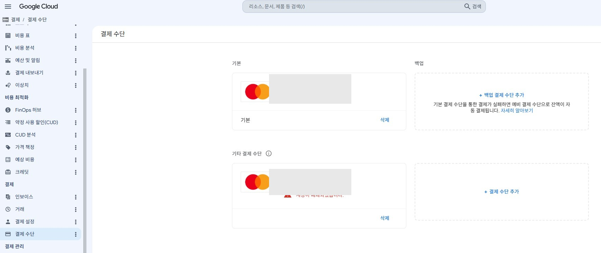

*[그림 8] 등록이 끝나면 [결제] → [결제 수단]에서 카드가 "기본"으로 표시된다*

7. 카드사에 따라 약 1달러의 승인 문자가 올 수 있다. 본인 확인용 임시 승인이며 청구되지 않고 자동 취소된다.
8. 신규 가입자에게는 일정 기간 사용할 수 있는 무료 체험 크레딧이 제공되는 경우가 있다. 제공 여부와 금액은 시점에 따라 다르며, 제공된다면 본 실습 비용은 크레딧 안에서 처리된다.

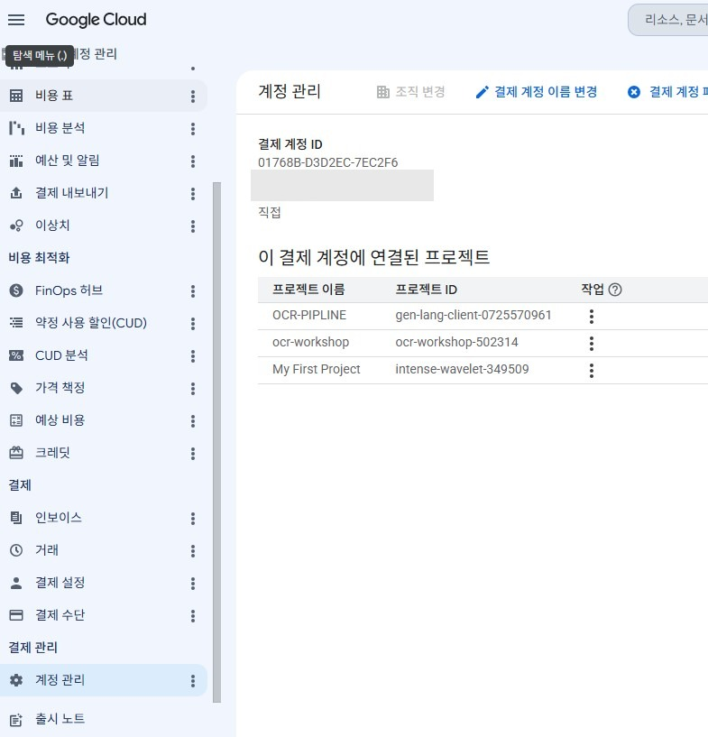

*[그림 9] [결제] → [계정 관리]에서 이 결제 계정에 연결된 프로젝트 목록에 ocr-workshop이 보이면 연결 완료*

> ✔ **여기까지 확인**: 탐색 메뉴(☰) → [결제] → [계정 관리]에서 연결된 프로젝트 목록에 ocr-workshop이 표시되면 된다.

### 3-4. Vision API 켜기

Google Cloud에는 수백 개의 기능이 있고 기본적으로 모두 꺼져 있다. 그중 문자 인식 기능인 Vision API 하나만 켠다.

1. 탐색 메뉴(☰)를 클릭하고 [API 및 서비스]에 마우스를 올린 뒤, 옆에 나타나는 [라이브러리]를 클릭한다.

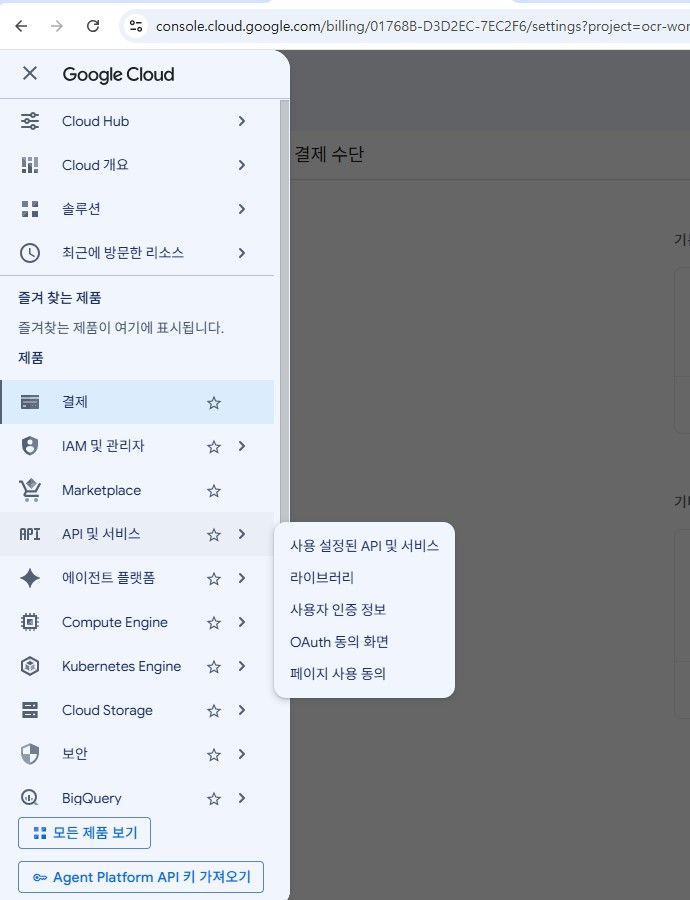

*[그림 10] [API 및 서비스]에 마우스를 올리면 [라이브러리] 항목이 나타난다*

2. 화면 가운데 검색창에 `Cloud Vision API` 를 입력한다. 자동완성 목록에 "cloud vision api"가 나타나면 클릭한다.

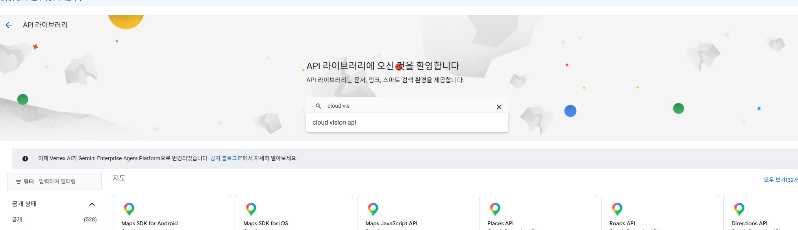

*[그림 11] API 라이브러리 검색창. 몇 글자만 입력해도 자동완성이 나타난다*

3. 검색 결과에서 **Cloud Vision API** 카드를 클릭한다. 비슷한 이름이 여럿 나올 수 있으니 이름이 정확히 일치하는 것을 선택한다.

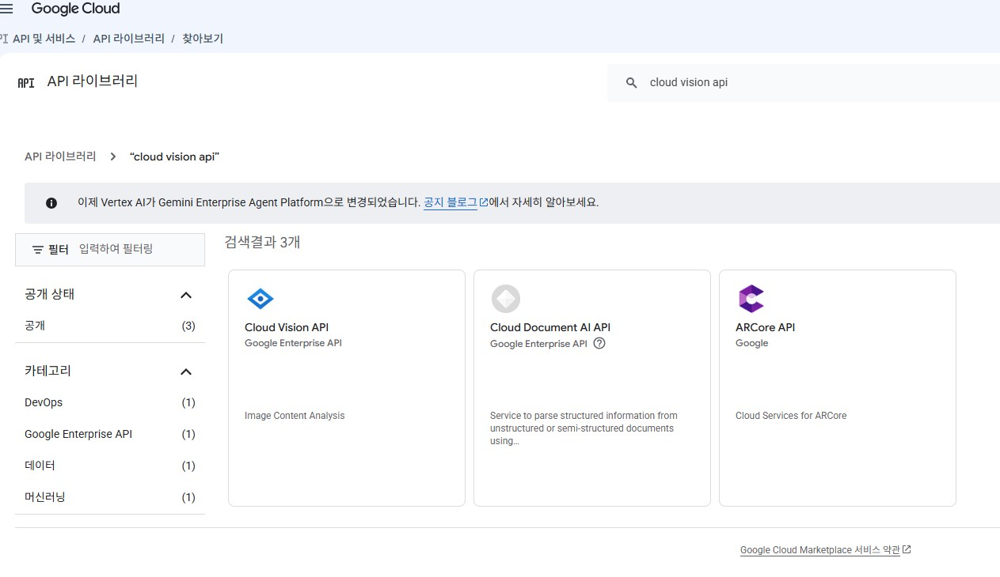

*[그림 12] 검색 결과 화면. 맨 왼쪽의 Cloud Vision API 카드를 클릭한다*

4. 파란색 [사용] 버튼을 클릭한다.

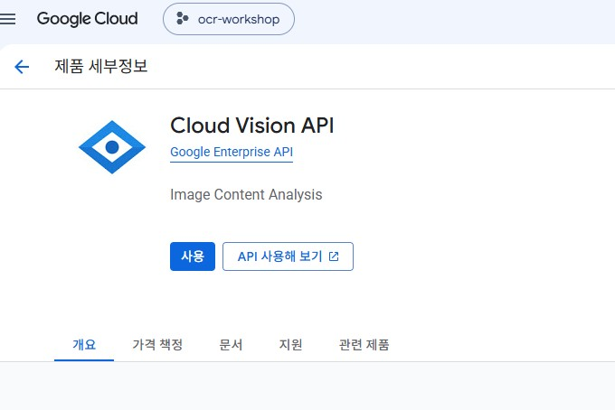

*[그림 13] Cloud Vision API 제품 세부정보 화면. 파란색 [사용] 버튼을 클릭한다*

5. 잠시 후 "API/서비스 세부정보" 화면으로 바뀌고 위쪽에 **[API 사용중지]** 라고 표시되면 켜진 것이다(그림 14의 위쪽 참고). 버튼이 처음부터 [관리]나 [API 사용중지]로 보이면 이미 켜져 있는 상태이므로 그대로 다음 단계로 넘어간다.

### 3-5. 서비스 계정을 만들고 JSON 파일 내려받기

서비스 계정이란 사람이 아닌 프로그램에게 부여하는 계정이다. 우리가 만들 프로그램이 이 계정의 이름으로 Vision API를 호출하며, JSON 파일이 그 신분증이다.

1. 탐색 메뉴(☰)를 클릭하고 [IAM 및 관리자]에 마우스를 올린 뒤 [서비스 계정]을 클릭한다.

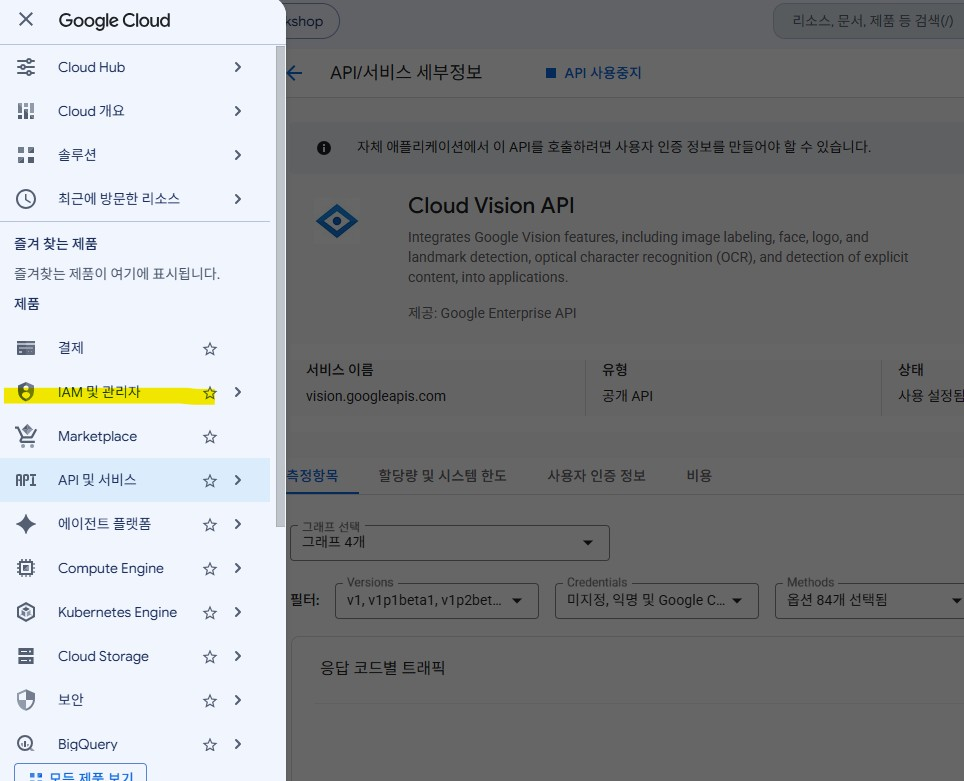

*[그림 14] Vision API 설정이 끝난 세부정보 화면(위쪽에 "API 사용중지" 표시). 탐색 메뉴를 열어 [IAM 및 관리자]로 이동한다*

2. "'ocr-workshop' 프로젝트의 서비스 계정" 화면이 나온다. 위쪽의 **[+ 서비스 계정 만들기]** 를 클릭한다.

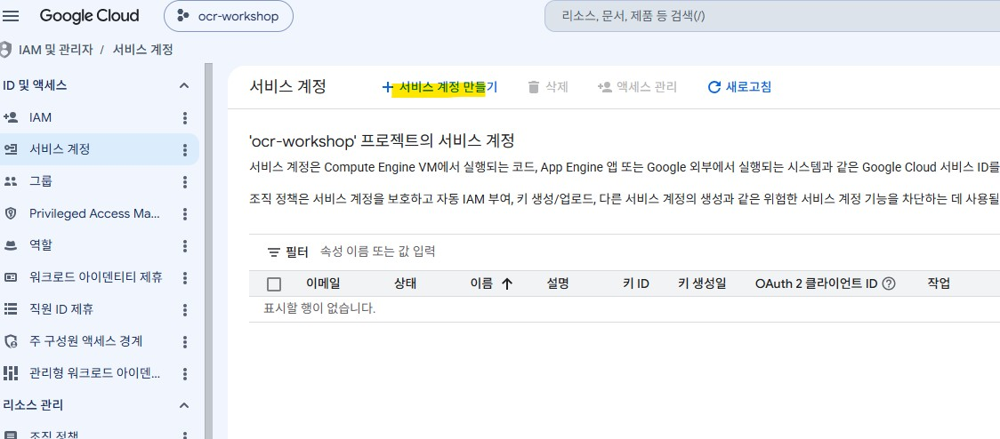

*[그림 15] 서비스 계정 화면. 위쪽의 [+ 서비스 계정 만들기]를 클릭한다*

3. "서비스 계정 이름" 칸에 `ocr-vision` 을 입력한다. 바로 아래 "서비스 계정 ID"는 자동으로 채워지므로 건드리지 않는다.
4. 아래의 "권한"과 "액세스 권한이 있는 주 구성원" 단계는 모두 (선택사항)이므로 입력하지 않는다. 맨 아래 파란색 **[만들고 닫기]** 를 클릭한다.

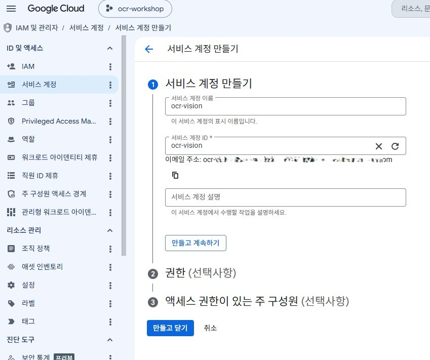

*[그림 16] 서비스 계정 이름 입력 화면. 권한 단계는 건너뛰고 아래의 [만들고 닫기]를 클릭한다*

5. 서비스 계정 목록 화면으로 돌아온다. 방금 만든 계정이 `ocr-vision@ocr-workshop-xxxxxx.iam.gserviceaccount.com` 같은 이메일 형태로 표시된다. 이 이메일 주소를 클릭한다.

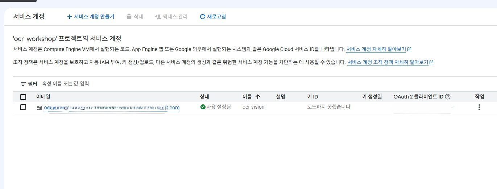

*[그림 17] 서비스 계정 목록. 이메일 주소를 클릭해 상세 화면으로 들어간다*

6. 화면 위쪽 탭 중 **[키]** 를 클릭한다.

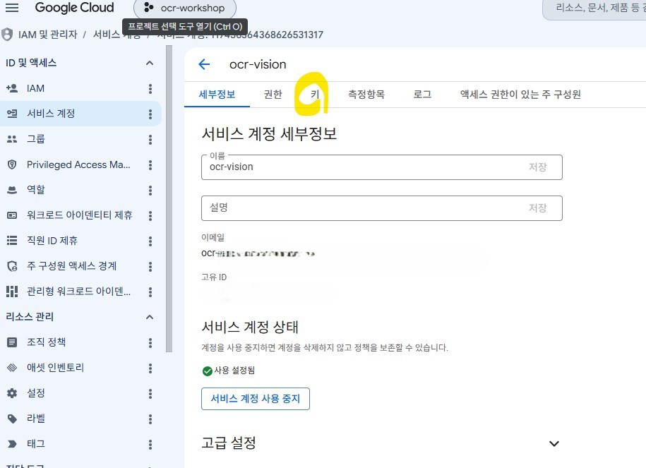

*[그림 18] 서비스 계정 상세 화면의 [키] 탭*

7. [키 추가] 버튼을 클릭하고 [새 키 만들기]를 선택한다.

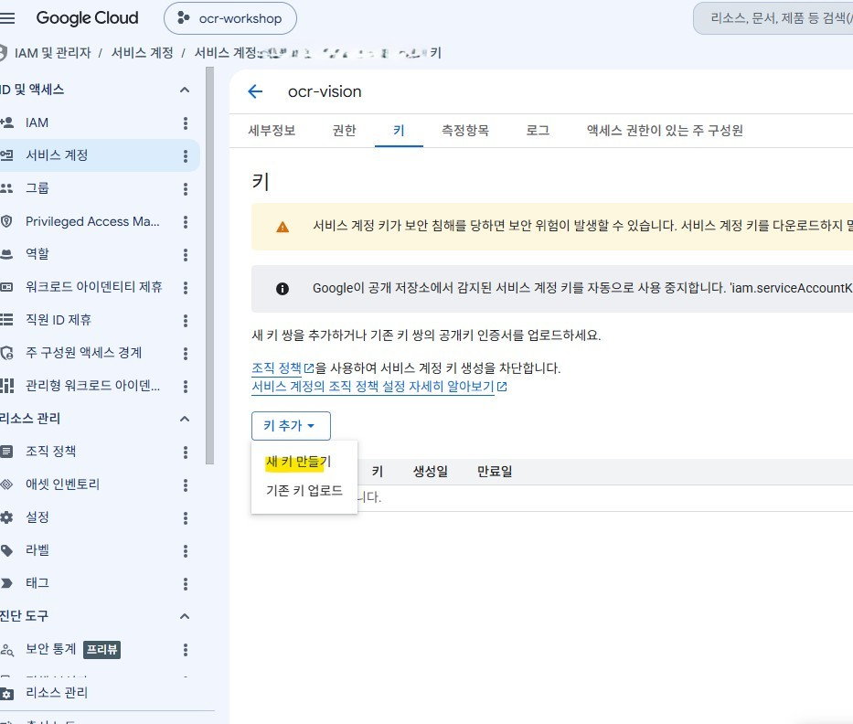

*[그림 19] [키 추가] → [새 키 만들기]*

8. 팝업 창에서 키 유형이 **JSON**으로 선택되어 있는지 확인하고(기본값) [만들기]를 클릭한다.

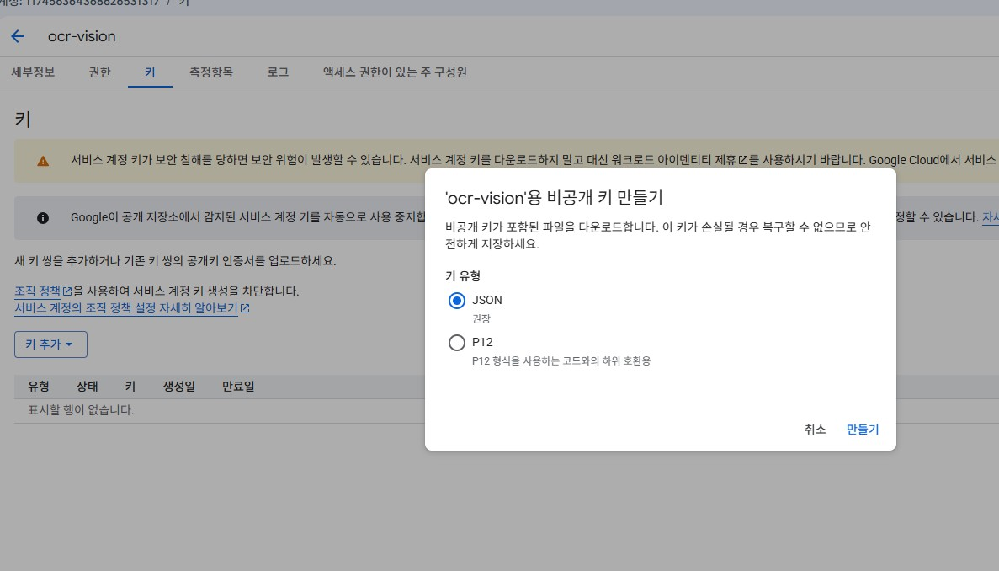

*[그림 20] 키 유형 JSON 선택 후 [만들기]*

9. "비공개 키가 컴퓨터에 저장됨"이라는 메시지와 함께 파일이 자동으로 다운로드된다. 파일 이름은 `ocr-workshop-xxxxxx-xxxxxxxxxxxx.json` 형태다.

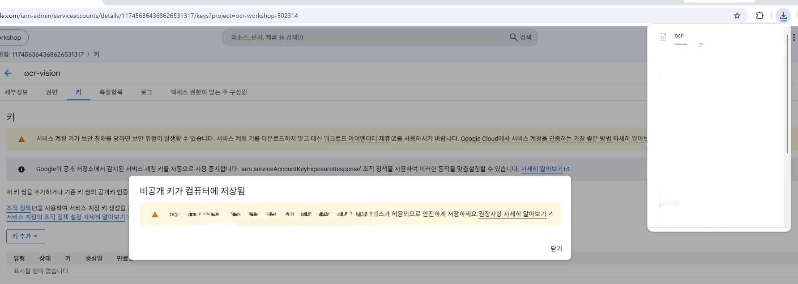

*[그림 21] JSON 키 파일 다운로드 완료*

### 3-6. JSON 파일 보관하기

1. 바탕화면에서 마우스 오른쪽 버튼을 클릭하고 [새로 만들기] → [폴더]를 선택해 `ocr-workshop` 폴더를 만든다.
2. Chrome 창 오른쪽 위의 다운로드 아이콘(↓)을 클릭하거나 파일 탐색기에서 [다운로드] 폴더를 열어, 방금 받은 `.json` 파일을 찾아 **바탕화면의 ocr-workshop 폴더로 옮긴다.** 강의 당일 이 파일을 바로 찾아 사용해야 한다.
3. 이 파일은 비밀번호와 같다. **타인에게 전송하거나, 이메일·메신저·인터넷 게시판에 올리지 않는다.**
4. 파일을 잃어버렸다면 3-5의 5~9번을 반복하면 새 키 파일을 받을 수 있다.

> ✔ **여기까지 확인**: 첫 번째 키 발급 완료. 바탕화면 ocr-workshop 폴더에 .json 파일이 있으면 된다.

## 4. 두 번째 키: Gemini API 문자열 키 발급

첫 번째 키보다 간단하다. 5분이면 끝난다.

1. Chrome에서 새 탭을 열고 주소창에 `aistudio.google.com` 을 입력한 뒤 Enter 키를 누른다.
2. 로그인 화면이 나오면 **3번에서 사용한 것과 같은 개인 계정**으로 로그인한다. 이미 로그인되어 있다면 오른쪽 위 프로필 아이콘으로 계정을 확인한다. 처음 접속하면 약관 동의 창이 나오는데, 동의하고 계속한다.
3. 왼쪽 메뉴에서 **[API 키]** 를 클릭한다. "API 키" 화면이 나오면 **오른쪽 위의 [API 키 만들기]** 를 클릭한다.

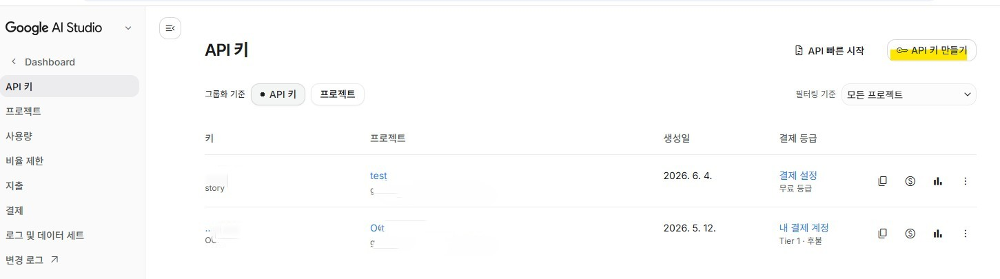

*[그림 22] AI Studio의 API 키 화면. 오른쪽 위의 [API 키 만들기]를 클릭한다*

4. "새 키 만들기" 창이 열린다. "키 이름 지정" 칸에 `gemini_key` 를 입력한다.
5. "가져온 프로젝트 선택" 드롭다운을 클릭한다. 목록에 ocr-workshop이 보이면 바로 선택하고 7번으로 넘어간다. 보이지 않으면 **[프로젝트 가져오기]** 를 클릭한다.

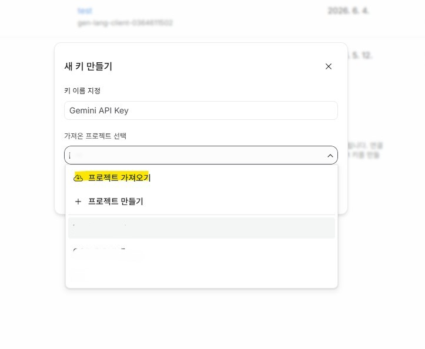

*[그림 23] 새 키 만들기 창. 드롭다운에 프로젝트가 없으면 [프로젝트 가져오기]를 클릭한다*

6. "프로젝트 가져오기" 화면에서 **ocr-workshop** 을 찾아 체크한다. 목록이 길면 위쪽 검색창에 `ocr` 을 입력한다. 오른쪽의 **[가져오기]** 를 클릭한다.

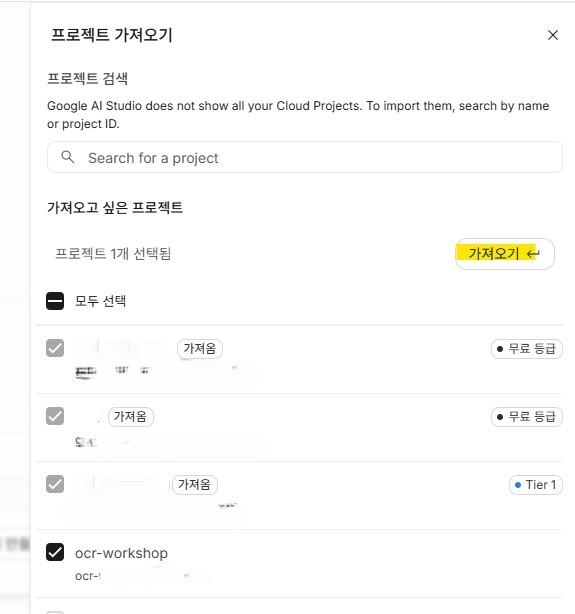

*[그림 24] 프로젝트 가져오기 화면. ocr-workshop을 체크하고 [가져오기]를 클릭한다*

7. 다시 "새 키 만들기" 창으로 돌아온다. 프로젝트가 **ocr-workshop** 으로 선택되어 있는지 확인하고 **[키 만들기]** 를 클릭한다.

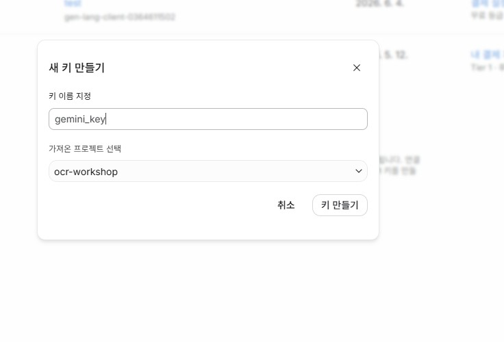

*[그림 25] 키 이름과 프로젝트를 확인한 뒤 [키 만들기]를 클릭한다*

8. "API 키 세부정보" 창에 긴 문자열 형태의 키가 표시된다. 문자열 옆의 **복사 아이콘**을 클릭한다.

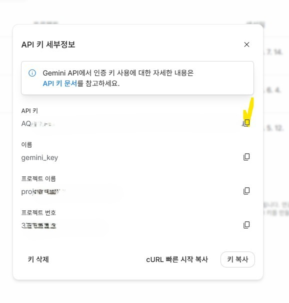

*[그림 26] API 키 세부정보 창. 키 문자열 옆의 복사 아이콘을 클릭한다*

9. 메모장을 연다(Windows: 시작 버튼 → "메모장" 검색 / Mac: Spotlight에서 "텍스트 편집기" 검색). Ctrl+V(Mac은 Cmd+V)로 붙여넣는다.
10. 파일을 3-6에서 만든 **바탕화면 ocr-workshop 폴더**에 `gemini_key.txt` 라는 이름으로 저장한다.
11. 이 문자열 역시 비밀번호와 같다. **타인에게 공유하지 않는다.** 나중에 다시 필요하면 API 키 화면의 목록에서 해당 키를 클릭해 세부정보 창에서 다시 복사할 수 있다.

> ✔ **여기까지 확인**: 두 번째 키 발급 완료. 바탕화면 ocr-workshop 폴더에 gemini_key.txt 파일이 있으면 된다.

## 5. Colab 접속 확인과 키 파일 올리기

### 5-1. Colab 접속 확인

강의 실습은 Google Colab이라는 무료 서비스에서 진행한다. 인터넷 브라우저 안에서 코드를 실행하는 공간이며, 별도 프로그램 설치는 필요 없다.

1. Chrome에서 새 탭을 열고 `colab.research.google.com` 에 접속한다.
2. 오른쪽 위 프로필 아이콘으로 **같은 개인 계정**으로 로그인되어 있는지 확인한다.
3. 시작 화면 팝업이 뜨면 닫아도 된다. 접속만 확인되면 사전 준비는 끝이다.
4. 실습용 자료 링크와 키 등록 절차는 각 강의·실습의 안내에 따라 진행한다.

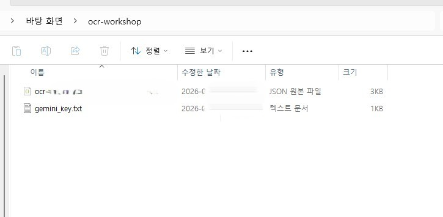

*[그림 27] 사전 준비가 끝난 상태. 바탕화면 ocr-workshop 폴더 안에 JSON 파일과 gemini_key.txt가 함께 있다*

### 5-2. JSON 키 파일을 Google Drive에 올리기

**이 단계를 건너뛰면 실습 당일 진행할 수 없다.**

실습은 Colab에서 이루어지는데, Colab은 인터넷 너머에서 돌아가는 남의 컴퓨터이므로 **본인 PC의 바탕화면을 볼 수 없다.** 그래서 Vision 키 파일을 Google Drive에 올려 두고, 실습에서는 그 위치를 알려 주는 방식으로 사용한다.

1. Chrome에서 새 탭을 열고 `drive.google.com` 에 접속한다. **지금까지 사용한 것과 같은 개인 계정**인지 오른쪽 위 프로필 아이콘으로 확인한다.
2. 왼쪽 위 **[+ 신규]**(또는 [새로 만들기])를 클릭하고 [새 폴더]를 선택한다. 폴더 이름에 `keys` 를 입력하고 [만들기]를 누른다.
3. 만들어진 **keys 폴더를 더블클릭해 연다.**
4. 바탕화면 ocr-workshop 폴더를 열고, 그 안의 **`.json` 파일을 끌어다 브라우저 화면 위에 놓는다.** "업로드 완료" 표시가 뜰 때까지 기다린다.
5. 올라간 파일 이름을 확인해 둔다. `ocr-workshop-xxxxxx-xxxxxxxxxxxx.json` 형태다. 실습에서 이 이름을 쓴다.

`gemini_key.txt`는 올리지 않는다. 그 키는 파일이 아니라 문자열이라 실습 중에 화면에 붙여넣는다.

> ✔ **여기까지 확인**: Google Drive의 `내 드라이브 → keys` 폴더 안에 .json 파일이 보이면 된다. 실습에서는 이 위치를 `/content/drive/MyDrive/keys/파일이름.json` 이라는 경로로 부른다.

## 6. 예상 비용

**Vision API**는 월 1,000장까지 무료다. 실습 분량은 물론이고, 수백 장 규모의 개인 연구도 이 한도 안에서 끝나는 경우가 많다.

**Gemini API**는 위 절차대로 하면 결제 계정이 연결된 프로젝트 안에서 키가 만들어지므로 처음부터 유료 등급으로 동작한다. 실측으로는 이미지 한 장에 몇 원 수준이다. 실습에서 다루는 분량이라면 대체로 십원에서 백원 단위에 그친다.

유료 등급을 쓰는 것은 요금 때문이 아니라 두 가지 조건 때문이다.

- 무료 등급에는 분당·일일 호출 한도가 있어, 여러 사람이 동시에 실습하면 중간에 막힐 수 있다.
- **무료 등급에서는 입력한 내용이 구글의 모델 개선에 사용된다.** 미간행 소장 자료를 다루는 연구에서는 이 조건이 특히 문제가 된다. 소장기관과의 이용 조건에 걸릴 수 있으므로, 실제 연구에서는 유료 등급을 쓴다.

유료 등급으로 동작하는지는 AI Studio의 API 키 페이지에서 확인한다. 해당 프로젝트의 Plan 칸에 "Paid"로 표시되면 맞다. 이 구분은 사용한 금액이나 분량과 무관하며, 결제 계정이 연결되어 있는지로만 갈린다.

위 금액은 2026년 7월 실측 기준이며, Google의 요금 정책은 바뀔 수 있다. 실제 청구액은 Cloud Console의 결제 화면에서 확인한다.

실습 후 과금이 걱정된다면 결제 계정을 비활성화하거나 프로젝트를 삭제하면 이후 어떤 비용도 발생하지 않는다. 절차는 각 강의 마지막에 안내한다.

## 7. 막혔을 때: 자주 발생하는 문제

| 증상 | 원인과 해결 |
|---|---|
| Cloud Console에서 메뉴가 회색으로 비활성화되어 있거나 "조직 관리자에게 문의하세요"가 뜬다 | 기관 계정으로 로그인된 상태다. 오른쪽 위 프로필 아이콘 → 개인 계정으로 전환한 뒤 새로고침한다. |
| 프로젝트를 만들었는데 다음 단계에서 안 보인다 | 왼쪽 위 프로젝트 선택 버튼이 다른 프로젝트로 되어 있다. 버튼을 눌러 ocr-workshop을 다시 선택한다. |
| "이 API를 사용하려면 결제 계정이 필요합니다"가 뜬다 | 3-3 결제 등록이 완료되지 않았거나, 결제 계정이 이 프로젝트에 연결되지 않았다. ☰ → [결제]에서 상태를 확인한다. |
| 카드 등록이 거절된다 | 해외 결제가 차단된 카드다. 카드사 앱이나 고객센터에서 해외 결제 차단 여부를 확인하고 해제하거나 다른 카드를 사용한다. |
| JSON 파일을 어디에 받았는지 모르겠다 | Chrome 오른쪽 위 다운로드 아이콘(↓) → 파일 옆 [폴더에서 보기]를 클릭하면 저장 위치가 열린다. 찾을 수 없으면 3-5의 5~9번으로 새 키를 받는다. |
| AI Studio에서 [API 키] 메뉴가 안 보인다 | 화면 개편으로 위치가 바뀌었을 수 있다. 왼쪽 메뉴를 펼쳐 열쇠 아이콘 또는 "API"가 들어간 항목을 찾는다. 그래도 없으면 화면을 캡처해 각 강의 문의처로 보낸다. |
| 실습 중 코랩이 "키 파일을 찾지 못했습니다"라고 한다 | JSON 파일이 Google Drive에 올라가 있지 않거나, 입력한 경로가 실제 위치와 다르다. 5-2를 다시 확인한다. 바탕화면에만 두어서는 코랩이 읽지 못한다. |
| 두 키 중 어느 것을 어디에 써야 할지 헷갈린다 | **파일**(JSON)은 Vision(텍스트 추출), **문자열**(gemini_key.txt)은 Gemini(문맥 교정)이다. 각 실습의 안내에 따라 각각의 자리에 등록하므로, 지금은 둘 다 바탕화면 ocr-workshop 폴더에 준비해 두기만 하면 된다. |

## 8. 최종 체크리스트

실습 전에 아래 여섯 항목을 확인한다.

- [ ] 모든 절차를 **개인 Google 계정**으로 진행했다
- [ ] Google Cloud에 `ocr-workshop` 프로젝트를 만들고 결제 계정을 연결했다
- [ ] Cloud Vision API를 켜고, **서비스 계정 JSON 파일**을 바탕화면 ocr-workshop 폴더에 보관했다
- [ ] 그 **JSON 파일을 Google Drive의 `keys` 폴더에 올렸다** (5-2)
- [ ] Google AI Studio에서 발급한 **문자열 키**를 gemini_key.txt로 같은 폴더에 보관했다
- [ ] Google Colab에 개인 계정으로 접속되는 것을 확인했다

**문의처**: 각 강의·워크숍 안내문에 명시된 담당자를 따른다.

---

*이 안내는 2026년 7월 기준으로 작성되었다. Google의 화면과 정책은 바뀔 수 있으므로, 절차가 다르면 각 강의 문의처로 알려 주기 바란다.*
